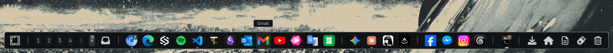
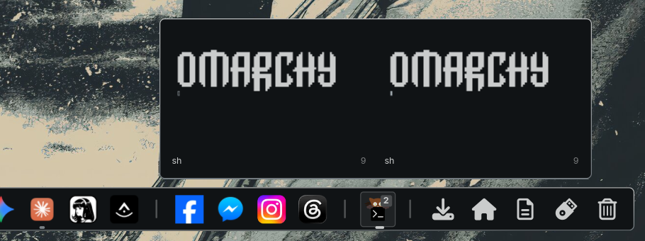
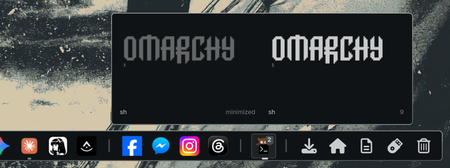
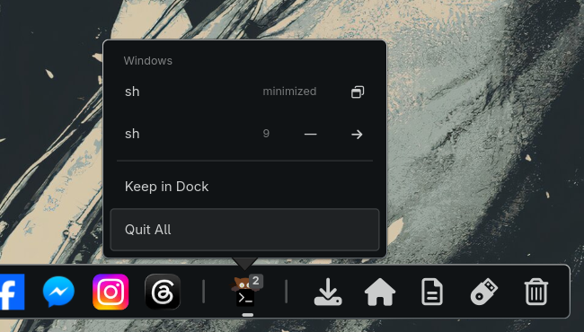
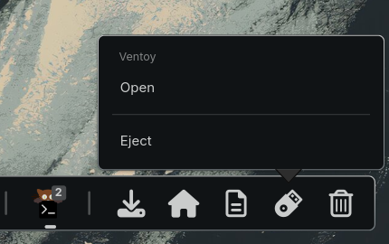
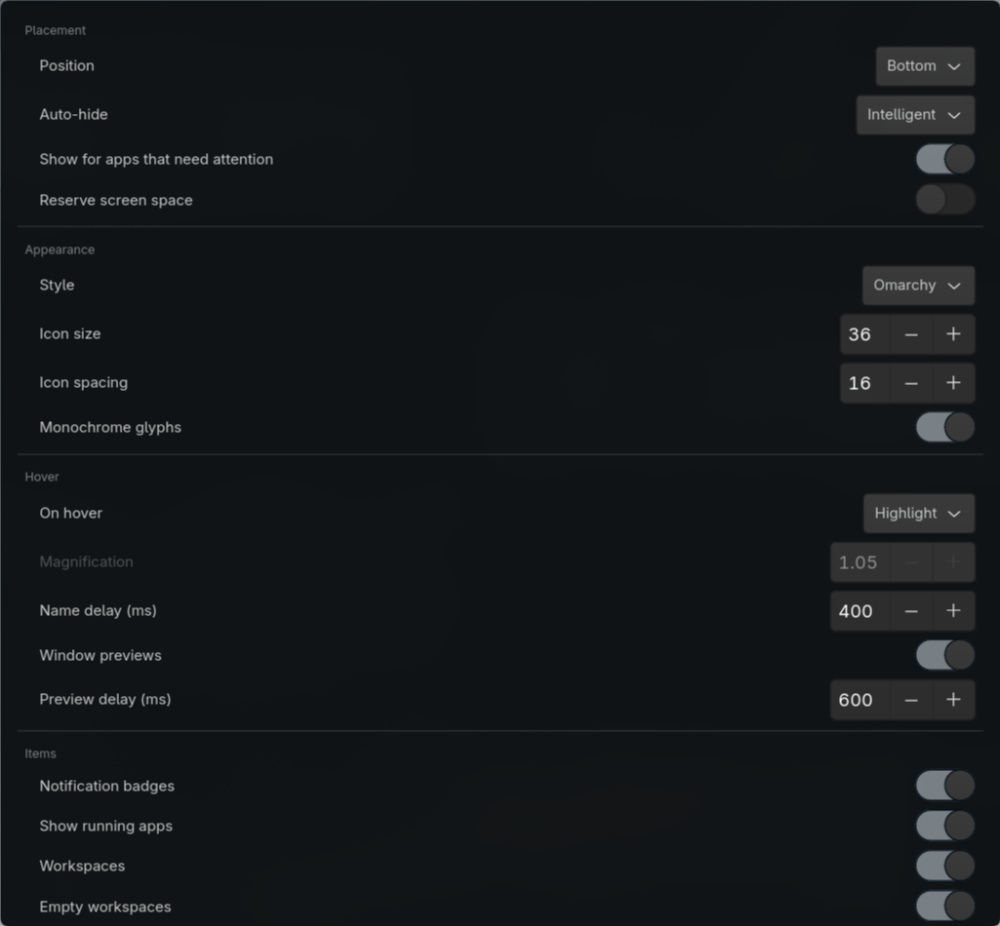

# omarchy-dock

A dock for [Omarchy](https://omarchy.org/) that looks like it came with it.

Rust + GTK4 on `gtk4-layer-shell`, talking to Hyprland directly. It reads the
active Omarchy theme's own design tokens, so it is drawn with the same
background, borders, hover fills, corner radius and type scale as the bar and
the menus — rather than being a dock that merely runs on the same desktop.



If the dock earns a place on your desktop, a ❤️ on its
[Omarchy plugin page](https://omarchyplugins.com/plugin.html?id=io.github.szlukabence.omarchy-dock)
helps other people find it.

## Install

```bash
curl -LO https://github.com/szlukabence/omarchy-dock/releases/download/v1.3.0/omarchy-dock-1.3.0-1-x86_64.pkg.tar.zst
echo "39df7664469215c5230d105e111b7e0a1caf2b23f8960398adefef33b4ec862e  omarchy-dock-1.3.0-1-x86_64.pkg.tar.zst" | sha256sum -c - &&
  sudo pacman -U omarchy-dock-1.3.0-1-x86_64.pkg.tar.zst
omarchy plugin add https://github.com/szlukabence/omarchy-dock.git --enable
omarchy-dockctl install
```

The first lines install the dock as an ordinary pacman package from the
[v1.3.0 release](https://github.com/szlukabence/omarchy-dock/releases/tag/v1.3.0) —
prebuilt, nothing to compile. The next adds the Omarchy plugin that starts and
stops it; the last adds the theme hook and menu entries.

The release is not signed, so the package is checked against the SHA-256 written
above before pacman sees it. That checksum is part of this repository, so it is
reviewed along with the code: if the file on the release is ever replaced,
`sha256sum -c` reports `FAILED` and nothing is installed. Download first, then
install the file: `pacman -U <url>` does not work here, because Arch's default
`pacman.conf` requires a signature for packages fetched from a URL.

### Building it yourself

```bash
omarchy plugin add https://github.com/szlukabence/omarchy-dock.git --enable
cd ~/.config/omarchy/plugins/io.github.szlukabence.omarchy-dock && ./install.sh
```

`omarchy plugin add` only *clones* a repository — it never builds or runs
anything. But the clone it leaves behind is the full source tree, so the plugin
can build the binary it supervises. That is what `install.sh` does: `makepkg
-si`, so pacman still owns the result, and then `omarchy-dockctl install`. It
takes a couple of minutes and asks for your password once.

The plugin on its own is only the supervisor — it starts and stops the dock and
puts it in `omarchy menu plugin`. Install it without the dock and it says so,
rather than failing with "command not found".

### Already have a checkout

```bash
./install.sh
```

### AUR

Not yet — AUR registration is closed. Both packages are ready to publish:
`packaging/aur/PKGBUILD` builds from a pinned, checksummed commit, and
`packaging/aur-bin/PKGBUILD` repackages the release tarball, checked against
its SHA-256. Once they are up, installing becomes `omarchy pkg aur add
omarchy-dock-bin`.

### Releasing

Bump the version in `Cargo.toml`, `manifest.json` and
`packaging/local/PKGBUILD`, commit, then tag and push:

```bash
packaging/release.sh 1.3.0              # optional rehearsal: tests, builds, fills dist/
git tag v1.3.0 && git push origin master v1.3.0
```

The tag starts the release workflow, which builds on Arch with that same
script and publishes a GitHub release carrying the package, a tarball of the
binaries, and `SHA256SUMS`. Every input to that build is pinned: the container
image by digest, its packages to one day's snapshot of the Arch Linux Archive,
the Rust release by `rust-toolchain.toml`, the crates by `Cargo.lock`, and the
checkout action by commit. It refuses a tag that disagrees with any of the
version numbers above. Afterwards, update the version and the package's
checksum in the install lines above (from `SHA256SUMS`, which the workflow's
summary shows); in `packaging/aur/PKGBUILD` set `pkgver`, `_commit` to
`git rev-parse vX.Y.Z^{commit}` and the checksum from `makepkg -g`; in
`packaging/aur-bin/PKGBUILD` the version and the tarball checksum from the same
summary. Regenerate each `.SRCINFO` with `makepkg --printsrcinfo`.

### Removal

```bash
omarchy-dockctl uninstall              # hook, menu entries, shell.json entry
omarchy plugin remove io.github.szlukabence.omarchy-dock   # the plugin checkout
sudo pacman -Rns omarchy-dock          # the binaries
rm -rf ~/.config/omarchy-dock          # your settings, if you want them gone
```

`uninstall` reverses everything `install` did and nothing else. Neither ever
overwrites or deletes a file that is not byte for byte what the dock wrote —
this build, an earlier release, or the copy it kept when it last wrote it.
Before it starts, `uninstall` asks a running dock to put any minimized windows
back on their workspaces, since nothing else brings them back.
Running `install` again only refreshes the dock's own files: if the plugin
directory or the hook holds anything else (your edit, or another plugin), it is
left alone, the plugin is not enabled, and the report says what was found.
`uninstall` removes the plugin directory only once that leaves it empty, and
never a git-managed plugin checkout — that is `omarchy plugin remove`'s job.
A file the dock edits a block in (the menu extension, `shell.json`,
`looknfeel.lua`) that exists but cannot be read — no permission, not UTF-8 — is
left alone and reported, never treated as empty. Every write goes to a
temporary file that is then renamed into place, so a crash or a full disk
leaves the old file whole, and a symlinked file stays a symlink. A symlinked
plugin directory — a development checkout, say — is neither written into nor
removed. `install --blur` reloads Hyprland and, if that brings new config
errors, puts `looknfeel.lua` back as it was, unless it changed in the meantime.

## What it does

| | |
| --- | --- |
|  |  |
| Rest on an app to see its windows, and click one to go to it. | Minimize from the dock: the window waits, dimmed, until you bring it back. |
|  |  |
| Every window in the menu, to restore, minimize or move to another workspace. | USB sticks, SD cards and phones show while plugged in, ready to open or eject. |

- **Pinned and running apps**, with running indicators, window-count badges,
  and a pulse when an app asks for attention. Click to focus, click the app in
  front to minimize it, click an idle icon to launch, middle-click for a new
  window.
- **Window previews**: rest the pointer on a running app and its windows appear
  as live thumbnails, each with its title and workspace — including windows on
  workspaces that are not on screen. Click one to jump straight to it.
- **Window menu**: right-click an app to see its windows by title and
  workspace, and minimize any of them, or move it to another workspace or the
  scratchpad.
- **Minimize**, which Hyprland lacks: click the app in front, use the
  button beside a window in its menu, or bind `omarchy-dockctl minimize`. The
  window is parked on a hidden `special:minimized` workspace, and its dot dims
  while all its windows are away. Click its dimmed preview or its menu row —
  or the icon, once all the app's windows are minimized — to bring it back to
  the workspace it came from. Focusing it any other way, like an app's
  launch-or-focus key or a notification, brings it back too. Minimizing hands
  focus to the window you used last on that workspace, without moving the
  pointer. With nothing left on screen, Hyprland keeps focus on the minimized
  window, so until you focus something else, a launch-or-focus key leaves it
  where it is; the dock still brings it back. Tabbed windows
  go and come back as their whole group, as Hyprland moves them. An app with
  a minimized window keeps its icon even with `items.show_running` off.
- **Notification badges** (opt-in): an app's icon counts the notifications it
  sent since you last looked at it — Gmail's mail on the Gmail web app, not on
  Chromium. Focusing the app clears it.
- **Media**: a progress ring on the app playing music, with play/pause, next
  and previous in its menu.
- **Remove web app**: an Omarchy web app's right-click menu can remove it,
  through Omarchy's own `omarchy-webapp-remove` — after a second click to
  confirm — and unpins it.
- **Downloads**: while a browser is downloading into your Downloads folder,
  its stack shows how many and a turning ring — turning rather than filling,
  since browsers never say how big a download will be — and gives one breath
  when a download lands.
- **Stop recording**: while Omarchy is screen-recording, a red stop button
  sits beside the launcher. With `hide_while_recording` on, the dock is out
  of the way but reveals it when you reach for the screen edge.
- **File drops**: drop files on an app to open them with it, or on Trash to
  trash them.
- **Drag to reorder**, with the icons parting to show where the drop lands.
  User-placed dividers drag too. Drag a running app that is not pinned among
  the pinned ones to pin it right there.
- **Folder stacks and Trash**, drawn as monochrome glyphs so only real
  applications carry colour — the way the bar draws its widgets. A stack's
  delete button moves the file to the Trash. Only in the Trash can anything be
  deleted for good, and both that and "Empty Trash" take a second click. Even
  then only a trashed item goes — one with the `.trashinfo` record every trash
  keeps — and never through a `Trash`, `files` or `info` that is a symlink.
- **Removable drives**: a USB stick, SD card, external disk or phone shows up
  beside Trash while it is plugged in, drawn as what it is. Click to open it
  in your file manager — mounting it first if need be, and letting you pick
  the partition when it has several — and right-click to eject the whole
  device; the dock tells you when it is safe to pull out. Internal disks never
  show. Drives need `gvfs`, which comes with Omarchy's file manager; phones
  and cameras need its backends too: `gvfs-mtp` for Android, `gvfs-afc` for
  iPhones and `gvfs-gphoto2` for cameras.
- **A workspace strip and scratchpad tile**, styled like the bar's own. Click a
  tile to switch, or scroll over the strip to step through them; drop an app
  icon on one to send that window there.
- **Command tiles** — a glyph, a label and a shell command, exactly how Omarchy
  menu rows are defined, so anything reachable from `omarchy` can be a tile.
- **The system tray**, hosted in the dock instead of the bar if you prefer.
- **Intelligent auto-hide** that also gets out of the way of fullscreen windows
  and screen recordings.
- **Live theming**: change theme, font size or Hyprland's rounding and the dock
  follows without a restart.

## Requirements

| | | |
| --- | --- | --- |
| [GTK4](https://gitlab.gnome.org/GNOME/gtk) | LGPL-2.1 | the toolkit |
| [gtk4-layer-shell](https://github.com/wmww/gtk4-layer-shell) | MIT | anchoring the surface to a screen edge |
| [Hyprland](https://hypr.land/) | BSD-3-Clause | window state, workspaces, dispatching |
| [Omarchy](https://omarchy.org/) | MIT | theme tokens, menu, notifications, plugin host |
| A Nerd Font | varies | glyphs for the launcher, stacks and Trash |

Only GTK4 and gtk4-layer-shell are hard requirements. Without Hyprland the dock
shows pinned apps but knows nothing about windows; without Omarchy it falls back
to a palette of its own. Nothing here reaches the network.

## What it writes

Everything the dock changes outside its own `~/.config/omarchy-dock/`, and only
ever in response to an explicit action:

| Path | When | What |
| --- | --- | --- |
| `~/.config/omarchy/hooks/theme-set.d/omarchy-dock` | `dockctl install` | A hook that restyles the dock after a theme change |
| `~/.config/omarchy/plugins/io.github.szlukabence.omarchy-dock/` | `dockctl install` | The supervisor plugin — skipped if it is a git checkout, or holds anything the dock did not write |
| `~/.config/omarchy/shell.json` | `dockctl install` | One entry in `plugins[]`, which is how the shell records a plugin as enabled |
| `~/.config/omarchy/extensions/omarchy-menu.jsonc` | `dockctl install` | A block between markers, spliced in rather than rewriting the file |
| `~/.config/hypr/looknfeel.lua` | `dockctl install --blur` **only** | Global blur plus a layer rule, needed only by `theme.style = "glass"` |
| `~/.config/hypr/bindings.lua` | `dockctl install --keys` **only** | A block between markers binding the dock-app hotkeys |
| The bar layout in `shell.json` | `workspaces.hide_bar_workspaces` **only** | Takes the bar's workspace widget out through the shell (as `omarchy plugin disable` does) while the dock shows workspaces; turning either off, or stopping the dock, puts it back exactly where it was. Its old position is kept in `~/.local/state/omarchy-dock/` |
| `~/.local/state/omarchy-dock/plugin-files/` | `dockctl install` | Copies of the hook and plugin files as written, so `install` and `uninstall` can tell them from anything else |

`uninstall` removes all of it, except what is no longer as the dock wrote it,
and gives the bar back its workspaces. An older, pre-namespace
`plugins/omarchy-dock/` is removed, and its `shell.json` entry dropped, only if
its files are byte for byte what 1.2.0 wrote; otherwise it may be another
plugin of that name, and both are left alone. The files earlier releases wrote
are kept in `resources/released/` for exactly these comparisons. Outside its
own config directory, nothing is written on start, on poll, or on open, apart
from the control socket `omarchy-dockctl` talks to, in your private
`$XDG_RUNTIME_DIR` — and, with `hide_bar_workspaces` on, the check at start
that the bar matches, undone when the dock stops. The dock saves its own `config.toml` only when you change
a setting from the dock (pinning, the settings window, the auto-hide toggle),
and then edits it in place: only the setting you changed is rewritten, and your
comments, layout and any keys it does not know stay as they were. While the
file has an error nothing is saved at all: the change is refused with a
notification rather than saved over what you wrote. The dock itself never runs
`sudo` — the only privileged step is the `pacman` install you run — and
`omarchy-dockctl install` and `uninstall` refuse to run as root, since
everything they touch is in your home. It makes no network requests. `/tmp` is
never written; the only thing read there is Omarchy's own screen-recording
marker. Drives are mounted, unmounted and ejected only when you click, through
udisks2 and gvfs as you — the way your file manager does it — and the dock never
writes to one.

Minimizing moves the window to a hidden `special:minimized` workspace and
gives it one Hyprland tag, `omarchy-dock-home:<workspace>`, so it can go back
where it was. Restoring removes the tag. Both happen only when you minimize, or
bring a minimized window back — from the dock, or by focusing it some other
way — and neither touches a file. A minimized window you move out yourself
keeps its tag until it is minimized again or closed. The tags are the dock's
only record, so a restarted dock finds its minimized windows again. Stopping it
leaves them minimized; `omarchy-dockctl restore --all` puts them all back, and
`uninstall` does that first.

## What it reads

A few features look at what other programs are doing. All of it stays in the
dock's memory: nothing is saved to disk or sent anywhere.

| What | For | Kept | Off with |
| --- | --- | --- | --- |
| Window images, through Hyprland's `hyprland_toplevel_export_v1` | Hover previews, captured only while you rest on an app | Small thumbnails of the last 48 windows, in memory | `preview.enabled = false` |
| Notifications, by watching `Notify` calls on the session bus (it listens, never answers) — only while badges are on, which they are not by default | Unread badges | Who sent each one — app name, desktop id, and a browser notification's site — as a count per app. Titles and text are never kept | `items.notification_badges = false` |
| Media players, over MPRIS | The progress ring and play controls | Title, artist and position of what is playing | — |
| Your Downloads folder | The download ring | How many partial `.crdownload`/`.part` files are in it | — |
| Removable drives, through GIO's volume monitor (gvfs and udisks2), and the kernel's mount table and `/sys/class/block` for partitions gvfs hides, like Ventoy's `VTOYEFI` | Drive icons and the partition picker | Each drive's name, icon, device path, and which partitions are mounted | `items.show_drives = false` |

## Looking like Omarchy

By default the dock draws itself the way the Omarchy shell draws the bar, the
menu and notifications, by reading the active theme's `shell.toml` — the same
design tokens every other surface is built from:

- panel and tooltip from `[popups]` / `[tooltip]`, menus and settings from
  `[menu]` (including its selected-row treatment), hover from `[controls]`
- the border is the Hyprland active-border gradient the shell references
- corner radius mirrors Hyprland's `decoration:rounding`, which is where the
  shell gets its own — set rounding to 0 and the dock is square too
- sizes follow the shell's scale, so `omarchy display text size` resizes the
  dock along with the bar
- the dock's own furniture (launcher, folder stacks, Trash) is drawn as
  monochrome glyphs, so only real applications carry colour. The launcher uses
  the same Omarchy mark as the bar's menu widget.

Set `theme.style = "glass"` for the translucent rounded slab instead.

## Omarchy integration

```bash
omarchy-dockctl install     # theme-set hook, shell plugin, menu entries
omarchy-dockctl install --blur   # ...and Hyprland blur, for style = "glass"
omarchy-dockctl status
omarchy-dockctl uninstall
```

| Piece | What it gives you |
| --- | --- |
| `theme-set` hook | Theme changes reach the dock the moment Omarchy finishes applying them, rather than whenever an inotify watch fires — so it can never restyle from a half-written theme |
| Shell plugin | The dock appears in `omarchy menu plugin`; enabling starts it, disabling stops it, and it autostarts with the shell. Skipped when the plugin is already a git checkout, so `omarchy plugin update` keeps working |
| Menu entries | `Dock` on the Omarchy menu and in its search: reveal, auto-hide, settings, reload, restart |

Everything lands in `~/.config/omarchy/` — plus the copies kept in
`~/.local/state/omarchy-dock/`, and `~/.config/hypr/looknfeel.lua` with
`--blur` — and is removed by `uninstall`, except anything that is no longer as
the dock wrote it. The menu extension file is shared with you, so it is edited
between markers and never rewritten.

Beyond that the dock also opens the shell's real surfaces (right-click the
launcher: Omarchy menu, themes, backgrounds, clipboard, emojis) rather than
drawing its own, reports through Omarchy notifications, and offsets itself past
the bar when both want the same screen edge (`dock.avoid_bar`).

## Blur

Only needed for `theme.style = "glass"` — the Omarchy style is opaque.

Omarchy ships with blur **disabled globally**, and Hyprland's per-layer blur
does nothing until the blur subsystem is on. Add to `~/.config/hypr/looknfeel.lua`:

```lua
hl.config({ decoration = { blur = { enabled = true, size = 6, passes = 3 } } })
hl.layer_rule({ match = { namespace = "^omarchy-dock$" }, blur = true, ignore_alpha = 0.2 })
```

## Configuration

`~/.config/omarchy-dock/config.toml`, created on first run and **seeded from
Omarchy's own `dock.json`**, so switching from the stock dock keeps your pins.
Edits apply on save — no restart. Changing the theme with `omarchy theme set`
restyles the dock live.

The common settings are also in a window: **Dock → Settings** in the Omarchy
menu, or `omarchy-dockctl settings`.



Notable keys:

| Key | Meaning |
| --- | --- |
| `dock.position` | `bottom` \| `top` \| `left` \| `right` |
| `dock.icon_size`, `dock.spacing` | Sizing; spacing defaults to whatever keeps magnified icons from overlapping. A dock too long for its screen shrinks to fit, down to 75% of this size |
| `magnify.hover` | `fill` (default, the shell's own hover treatment) \| `scale` (dock magnification) \| `none` |
| `magnify.zoom`, `.lift`, `.stiffness`, `.damping_ratio` | Hover feel for `scale`. Only the hovered icon scales |
| `autohide.mode` | `never` \| `intelligent` \| `always` (default: `intelligent`) |
| `launcher.enabled`, `.icon`, `.command` | Omarchy menu button at the head of the dock; empty command runs `omarchy-menu toggle` |
| `monitors.mode` | `all` (a dock on every monitor) \| `primary` (only `monitors.primary`) \| `focused` (one dock that moves to whichever monitor has focus) |
| `items.folders` | Folder stacks, each with its own `enabled` flag; seeded from omadock's `pinnedFolders` |
| `items.commands` | Command tiles: `id`, `label`, `glyph`, `command`. Pin one by putting `cmd:<id>` in `pinned` |
| `workspaces.enabled`, `.show_empty`, `.scratchpad` | Workspace strip and scratchpad tile (both off by default — the bar already has workspaces) |
| `workspaces.hide_bar_workspaces` | Hide the bar's own workspace numbers while the dock shows workspaces, and restore them in place when turned off or when the dock stops (default: off) |
| `workspaces.persistent` | Workspaces 1 to N always get a tile, as the bar always shows 1–5, so there is somewhere to drop a window even on an empty workspace (default: 5) |
| `preview.enabled`, `.delay_ms`, `.width` | Window previews on hover (default: on, after 600 ms, 220 px tiles) |
| `items.notification_badges` | Red badge with how many notifications an app sent since you last focused it; a web app's come from its site, so Gmail's mail badges Gmail (default: off — it means watching every notification) |
| `items.media_controls` | Progress ring and play/pause/next on the icon of the app playing media (default: on) |
| `tray.enabled`, `.show_passive` | Host the system tray in the dock (off by default — the bar already has one) |
| `autohide.hide_on_fullscreen`, `.hide_while_recording` | Get out of the way of fullscreen windows and screen recordings, whatever `mode` says |
| `autohide.reveal_on_attention` | Slide a hidden dock out while an app's attention pulse runs — never over a fullscreen window, a recording or the screensaver (default: off) |
| `dock.spacing` | Gap between icons; omit for automatic (derived from hover zoom) |
| `dock.tooltip_delay_ms` | Delay before a hovered icon's name appears |
| `theme.style` | `omarchy` (default) \| `glass` |
| `theme.follow_shell_scale` | Track the shell's spacing/font scale (default: on) |
| `theme.radius` | Corner radius; omit to mirror Hyprland's `decoration:rounding` |
| `theme.user_css` | Extra CSS layered over the generated stylesheet |
| `items.glyph_ui` | Draw launcher, folders, drives and Trash as monochrome glyphs (default: on) |
| `items.show_drives` | Show plugged-in removable drives beside Trash (default: on) |
| `items.urgent_pulse` | Pulse an app's icon three times when it asks for attention; its red dot stays until you look (default: on) |
| `dock.avoid_bar` | Offset past the Omarchy bar when both share an edge (default: on) |

The dock can host the **system tray** itself: it registers as a
StatusNotifierItem host alongside the shell's, so items appear in both until
you turn off the bar's `omarchy.tray` widget. Clicks go straight to the
application — left activates, middle is the secondary action, right asks the
app to post its own menu, which belongs to it rather than to the dock.

`ContextMenu` is optional in the protocol, though: an item that serves its menu
only over DBusMenu — cc-switch, for one — will not respond to a right click,
and the dock logs that rather than pretending otherwise. Drawing those menus
means implementing DBusMenu, which is a whole protocol rather than a fallback.

Workspace tiles switch on click; dropping an app icon on one sends that
window there, and dropping on the scratchpad tile stashes it. A Chromium web
app with no `.desktop` file can still be pinned — its window class encodes its
URL, so the dock reconstructs `omarchy launch or focus webapp` for it.

Put `"---"` anywhere in `items.pinned` to insert a divider, or add one from the
settings panel. Drag pinned icons and dividers to reorder them — the dock parts to show where
the drop will land; right-click a divider to remove it. A divider is also
added automatically between pinned apps and running-but-unpinned ones, and
before Trash; dividers that would end up at either end are dropped.

Right-click the launcher for a short menu: the Omarchy surfaces the dock can
raise, and "Settings…", which opens a proper window (also `omarchy-dockctl
settings`, or `Dock > Settings` on the Omarchy menu). Everything writes
`config.toml`, so the window, a hand-edited file, and `omarchy-dockctl` all take
the same path into the running dock.

`theme.user_css` can reference the live palette, e.g. `@omarchy_accent`,
`@dock_bg`, `@dock_fg`.

## Hotkeys

```bash
omarchy-dockctl install --keys          # SUPER + CTRL + ALT + 1…9
omarchy-dockctl install --keys=CTRL+ALT # or a chord of your choosing
```

That binds a chord plus 1…9 to the first nine apps on the dock — pinned or
running, plus pinned command tiles, in the order they appear. The launcher,
dividers, workspace tiles, stacks and Trash are not counted, so adding a divider
does not renumber anything. A press focuses the app, minimizes it if it is
already in front, brings back the minimized window you used last if all of
them are minimized, or launches it.

The default is `SUPER + CTRL + ALT` because every simpler chord with the number
row is already Omarchy's: `SUPER` switches workspace, `SUPER + SHIFT` and
`SUPER + SHIFT + ALT` move windows between them, `SUPER + ALT` switches group
windows and `SUPER + CTRL` opens bar panels. `install --keys` checks Omarchy's
bindings and yours before writing anything and refuses a chord that is taken. It
writes a marked block into `~/.config/hypr/bindings.lua`, reloads Hyprland, and
puts the file back if Hyprland reports an error. `uninstall` removes it.

The same actions are available directly:

```bash
omarchy-dockctl activate 3        # focus / minimize / launch dock app 3
omarchy-dockctl minimize          # minimize the focused window
omarchy-dockctl restore           # bring back the minimized window used last
omarchy-dockctl restore --all     # put every minimized window back where it was
omarchy-dockctl toggle-autohide
omarchy-dockctl reveal | hide | reload | restyle | settings
```

`install --keys` does not bind minimize. To put it on a key, add a line to
`~/.config/hypr/bindings.lua`, for example:

```lua
o.bind("SUPER + CTRL + M", "Minimize window", "omarchy-dockctl minimize")
o.bind("SUPER + CTRL + SHIFT + M", "Restore window", "omarchy-dockctl restore")
```

## Development

```bash
cargo build --release
cargo test
cargo clippy --all-targets
```

CI runs clippy (warnings are errors) and the tests on Arch for every push to
`master` and every pull request; see `.github/workflows/ci.yml`.

`cargo build` alone does not change what runs if you installed the package —
rebuild it with `cd packaging/local && makepkg -f` and reinstall.

`src/bin/spike_magnify.rs` is the Phase-0 de-risking spike for hover
magnification, kept because it is the cheapest way to measure frame timing in
isolation. It is not shipped by either PKGBUILD.

## Notes on Hyprland 0.56

The IPC protocol is split. **Dispatch** is Lua
(`hl.dsp.focus({ window = 'address:0x…' })`); the classic
`/dispatch focuswindow address:…` form is gone. The **event stream** still uses
the old `name>>payload` text format. The two also disagree on addresses —
events omit the `0x` that JSON includes.

Sockets live in `$XDG_RUNTIME_DIR/hypr/$HYPRLAND_INSTANCE_SIGNATURE/`, not
`/tmp/hypr/`.

## License

MIT. See [LICENSE](LICENSE). The vendored Hyprland protocol used for window
previews is BSD-3-Clause; see [THIRD_PARTY_NOTICES](THIRD_PARTY_NOTICES).
